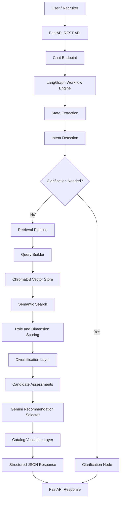

```mermaid
flowchart TD

    A["User / Recruiter"] --> B["FastAPI REST API"]

    B --> C["Chat Endpoint"]

    C --> D["LangGraph Workflow Engine"]

    D --> E["State Extraction"]

    E --> F["Intent Detection"]

    F --> G{"Clarification Needed?"}

    G -- Yes --> H["Clarification Node"]

    G -- No --> I["Retrieval Pipeline"]

    I --> J["Query Builder"]

    J --> K["ChromaDB Vector Store"]

    K --> L["Semantic Search"]

    L --> M["Role and Dimension Scoring"]

    M --> N["Diversification Layer"]

    N --> O["Candidate Assessments"]

    O --> P["Gemini Recommendation Selector"]

    P --> Q["Catalog Validation Layer"]

    Q --> R["Structured JSON Response"]

    R --> S["FastAPI Response"]

    H --> S
```
